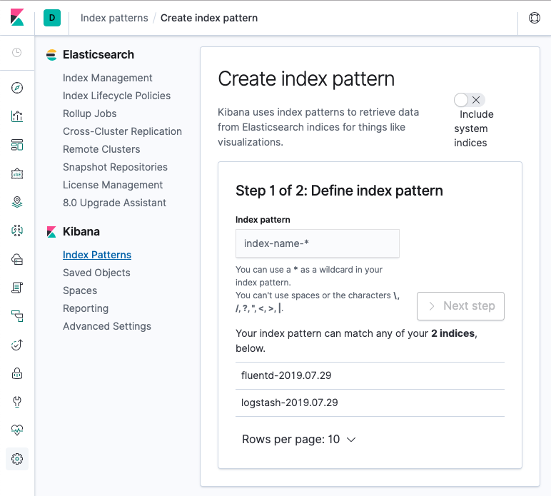
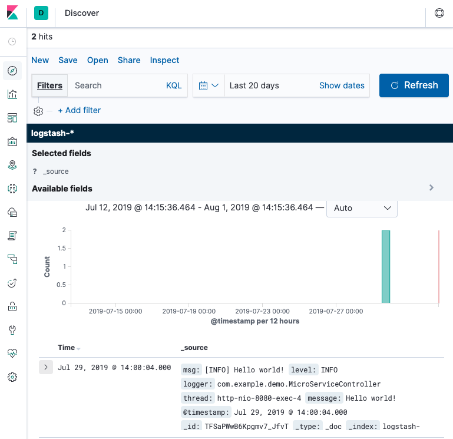

# Dockerized spring-boot app with EFK stack for centralized logging
- [Dockerized spring-boot app with EFK stack for centralized logging](#dockerized-spring-boot-app-with-efk-stack-for-centralized-logging)
  * [Description](#description)
  * [Pre-requisites](#pre-requisites)
  * [Create a simple spring boot app](#create-a-simple-spring-boot-app)
  * [Execute the app without docker](#execute-the-app-without-docker)
  * [Execute the app with docker](#execute-the-app-with-docker)
    + [Dockerize the app](#dockerize-the-app)
  * [Execute the app with docker-compose](#execute-the-app-with-docker-compose)
  * [Add EFK stack (elastic-search, fluentd, kibana) to centralize the logs](#add-efk-stack--elastic-search--fluentd--kibana--to-centralize-the-logs)
    + [Change the micro-service to send logs to fluentd server](#change-the-micro-service-to-send-logs-to-fluentd-server)
      - [Add logback fluentd appender to the microservice](#add-logback-fluentd-appender-to-the-microservice)
      - [Add fluentd](#add-fluentd)
        * [Add Fluentd Docker file](#add-fluentd-docker-file)
        * [Add Fluentd config file](#add-fluentd-config-file)
        * [Add Fluentd to docker-compose](#add-fluentd-to-docker-compose)
        * [Check fluentd receive our logs](#check-fluentd-receive-our-logs)
      - [Add elastic-search](#add-elastic-search)
        * [Add elastic-search container](#add-elastic-search-container)
        * [Forward logs from fluentd to elasticsearch](#forward-logs-from-fluentd-to-elasticsearch)
        * [Check elasticsearch receive our logs](#check-elasticsearch-receive-our-logs)
      - [Add kibana](#add-kibana)
        * [Add kibana container](#add-kibana-container)
        * [Check kibana reads our logs](#check-kibana-reads-our-logs)
        
## Description

This project presents how to dockerize an spring-boot app and run it together with EFK (elastic-search, fluentd, kibana)
stack as a different containers in order to learn how docker and docker-compose work.

<p align="center">
  
</p>

Components:
- `micro-service`: spring-boot rest application, it will listen to a simple *http get*, then it will respond with 
a hello-world message to the client and write it also in the application log. Logs will be sent to fluentd.
- `fluentd`: Unify all facets of processing log data: collecting, filtering, buffering, and outputting logs across multiple sources and destinations.
In our case, it will receive logs from the microservice format and forward/post them to elasticsearch.
- `elastic-search`: Search engine and a full-text, distributed NoSQL database.
- `kibana`: Front-end for elastic-search.


## Pre-requisites

`docker` and `java8`

## Create a simple spring boot app

The application is a super simple "micro-service" made in java 8 and spring-boot that exposes one simple endpoint:
```bash
curl -i http://localhost:8080/hello-world
HTTP/1.1 200 
Content-Type: text/plain;charset=UTF-8
Content-Length: 12
Date: Tue, 23 Jul 2019 14:29:31 GMT

Hello world!% 
```
Check the code in [app folder](./micro-service).

## Execute the app without docker
Build and run the micro-service:
```bash
cd micro-service
./gradlew build
java -jar build/libs/micro-service-0.0.1-SNAPSHOT.jar &
open http://localhost:8080/hello-world
```

## Execute the app with docker  

[Docker_CheatSheet](https://www.docker.com/sites/default/files/Docker_CheatSheet_08.09.2016_0.pdf)

### Dockerize the app
Build the micro-service artifact (from project root folder):
```bash
(cd micro-service && ./gradlew build)
```

Write a [Dockerfile](./micro-service/Dockerfile):
```
# Download docker from docker hub with all dependencies to run a java 8 application
FROM java:8-jdk-alpine

# Moving the app artifact from the host to the container
COPY ./build/libs/micro-service-0.0.1-SNAPSHOT.jar /usr/app/micro-service.jar

# The WORKDIR instruction sets the working directory for any RUN, CMD, ENTRYPOINT, COPY and ADD instructions that follow it in the Dockerfile.
WORKDIR /usr/app

# With it we inform Docker that a container will listen to specific port, the same as our app is using.
EXPOSE 8080

# Tell Docker to run the application, where first value is a command and the last two are parameters
ENTRYPOINT ["java","-Djava.security.egd=file:/dev/./urandom","-jar","micro-service.jar"]
```

Build the image and tag it:
```bash
docker build -t micro-service ./micro-service/.
```

Check the image is already created: 
```bash
docker images
```
```bash
REPOSITORY                                      TAG                 IMAGE ID            CREATED             SIZE
micro-service                                   latest              28a816a8dbd9        X days ago          163 MB
...
```
**Great!** now we have the java application in a controlled container.

Run the image in background:
```bash
docker run -d -p 3333:8080 --name ms -t --rm micro-service
```
`--name` to name th image
`--rm` to remove when killing the image, if not you will have to `docker ps -a` and `docker rm {id}` 

Check it is running as expected with docker:
`open http:localhost:3333/hello-world` or `curl -i http://localhost:3333/hello-world`

If you want to access to the container sh console:
```bash
docker exec -it ms /bin/sh
```

## Execute the app with docker-compose

Now that we have a docker image with the microservice up and running what we want is to add more containers and make them to communicate,
simulating a real environment.

To achieve that we will use `docker-compose` command: 

- [Compose](https://docs.docker.com/compose/) is a tool that comes with docker for defining and running multi-container Docker applications, usually used for development and testing purposes. 
With Compose, you use a YAML file to configure your application’s services. Then, with a single command, you create and start all the services from your configuration.

So, let's write a simple [docker-compose.yaml](docker-compose.yml):

```yaml
version: '3'
services:
  micro-service:
    image: micro-service
    build: ./micro-service
    ports:
      - "3333:8080"
```
- `ports` Expose ports (HOST:CONTAINER)

And run:
```bash
docker-compose up
```

## Add EFK stack (elastic-search, fluentd, kibana) to centralize the logs

### Change the micro-service to send logs to fluentd server

#### Add logback fluentd appender to the microservice

Now we need to config the application to send logs to fluentd data collector.

Add fluentd dependency to [gradle file](./micro-service/build.gradle)

```
dependencies {
   ...
    implementation group: 'org.fluentd', name: 'fluent-logger', version: '0.3.4'
    implementation group: 'com.sndyuk', name: 'logback-more-appenders', version: '1.5.6'
   ...
}
```

Add [logback file](./micro-service/src/main/resources/logback.xml) with the fluentd appender:

```xml
<?xml version="1.0" encoding="UTF-8"?>
<configuration>
    <include resource="org/springframework/boot/logging/logback/base.xml"/>
    <!-- If there is no ENV var FLUENTD_HOST then use localhost -->
    <property name="FLUENTD_HOST" value="${FLUENTD_HOST:-localhost}"/> 
    <property name="FLUENTD_PORT" value="${FLUENTD_PORT:-24224}"/>
    <appender name="FLUENT" class="ch.qos.logback.more.appenders.DataFluentAppender">
        <!-- Check tag and label fluentd info: https://docs.fluentd.org/configuration/config-file-->
        <tag>microservice.helloworld.access</tag>
        <label>normal</label>
        <remoteHost>${FLUENTD_HOST}</remoteHost>
        <port>${FLUENTD_PORT}</port>
    </appender>

    <appender name="CONSOLE" class="ch.qos.logback.core.ConsoleAppender">
        <layout class="ch.qos.logback.classic.PatternLayout">
            <Pattern>
                %d{HH:mm:ss.SSS} [%t] %-5level %logger{36} - %msg%n
            </Pattern>
        </layout>
    </appender>

    <root level="info">
        <appender-ref ref="CONSOLE" />
        <appender-ref ref="FLUENT" />
    </root>
</configuration>
```

If we try to run our container or just the app, it will fail. 

```bash
ERROR o.f.logger.sender.RawSocketSender - org.fluentd.logger.sender.RawSocketSender
```
It fails because there is no fluentd running neither in docker or localhost.

#### Add fluentd

To add fluentd we will add three things to make it work:

##### Add Fluentd Docker file
We will create extend fluentd docker image because we will install an elasticsearch plugin.
All fluentd files are placed in [`/fluentd` folder](fluentd)
```
FROM fluent/fluentd:v1.6-1

# Use root account to use apk
USER root

# install elasticsearch plugin
RUN apk add --no-cache --update --virtual .build-deps \
        sudo build-base ruby-dev \
 && sudo gem install fluent-plugin-elasticsearch \
 && sudo gem sources --clear-all \
 && apk del .build-deps \
 && rm -rf /tmp/* /var/tmp/* /usr/lib/ruby/gems/*/cache/*.gem

COPY fluent.conf /fluentd/etc/
COPY entrypoint.sh /bin/

USER fluent
```
Check [docker hub](https://hub.docker.com/r/fluent/fluentd/) page for more info.

##### Add Fluentd config file
Now, we need to add a [configuration file](https://docs.fluentd.org/configuration) to control the input and output behavior of Fluentd.
We will start with a simple behaviour, just print all logs coming from the microservice to the stdout in the fluentd host:
```
# Directives that determine the input sources
<source>
    # @type 'my_plugin_type': 'forward' plugin turns fluentd into a TCP endpoint to accept TCP packets
    @type forward
    
    # endpoint listening to port 24224
    port 24224
    
    # The bind address to listen to. In the context of servers, 0.0.0.0 means "all IPv4 addresses on the local machine". 
    # If a host has two ip addresses, 192.168.1.1 and 10.1.2.1, and a server running on the host listens on 0.0.0.0, 
    # it will be reachable at both of those IPs.
    bind 0.0.0.0
</source>

# This directive looks for events with matching tags and processes them
# in our case it match everything
<match **>
    # this output plugin prints events to stdout
    @type stdout
</match>
```
More info for plugins or configuration at [official documentation](https://docs.fluentd.org/).
##### Add Fluentd to docker-compose  

Let's add fluentd container to our docker compose file:
```yaml
version: '3'
services:
  micro-service:
    build: ./micro-service
    ports:
      - "3333:8080"
    environment:
      - FLUENTD_HOST=fluentd
      - FLUENTD_PORT=24224
    networks:
      - microservice-network

  fluentd:
    build: ./fluentd
    volumes:
      - ./fluentd/conf:/fluentd/etc
    ports:
      - "24224:24224"
      - "24224:24224/udp"
    networks:
      - microservice-network

networks:
  microservice-network: 
    # name: microservice_network custom naming obnly available in version 3.5
    driver: bridge # we have specified it, but this is the default driver
```
One problem we face here, is how to enable microservice container to send logs to fluentd container, even more, we don't want to know
about IPs, we just want to send logs to from microservice to a host name `fluentd`.
 
To reach the previous requirement, here we have introduced [`networks`](https://docs.docker.com/network/), docker provide this feature to connect different containers together.
We are using the default [`bridge` driver](https://docs.docker.com/network/bridge/), in a nutshell, a bridge network will expose to all containers connected all ports to each other and automatic DNS resolution between containers. 

##### Check fluentd receive our logs

Let's check we it works:
```bash
docker-compose up &
```
Wait to docker containers to start and call the microservice endpoint:
```bash
curl -i http://localhost:3333/hello-world
```
Now, if everything worked as expected, we should see both containers logging the message:
```bash
micro-service_1  | 16:40:43.507 [http-nio-8080-exec-2] INFO  c.e.demo.MicroServiceController - Hello world!
fluentd_1        | 2019-07-28 16:40:43 +0000 microservice.helloworld.access.normal: {"msg":"[INFO] Hello world!\n","level":"INFO","logger":"com.example.demo.MicroServiceController","thread":"http-nio-8080-exec-2","message":"Hello world!"}
```

#### Add elastic-search

##### Add elastic-search container

First let's add the new container with elastic search, in that case we will add the image directly to docker compose yaml,
we will get one of the lasts version from [https://www.docker.elastic.co/](https://www.docker.elastic.co/):
```yaml
version: '3'
services:
  micro-service:
    image: micro-service
    build: ./micro-service
    ports:
      - "3333:8080"
    environment:
      - FLUENTD_HOST=fluentd
      - FLUENTD_PORT=24224
    networks:
      - microservice-network
    depends_on:
      - fluentd
  elasticsearch:
    image: docker.elastic.co/elasticsearch/elasticsearch:7.2.0
    container_name: elasticsearch
    environment:
      - discovery.type=single-node
    volumes:
      - esdata:/usr/share/elasticsearch/data
    ports:
      - 9200:9200
    networks:
      - elasticsearch
    expose:
      - "9200"

  fluentd:
    build: ./fluentd
    volumes:
      - ./fluentd/conf:/fluentd/etc
    ports:
      - "24224:24224"
      - "24224:24224/udp"
    networks:
      - microservice-network
      - elasticsearch
    depends_on:
      - elasticsearch

networks:
  microservice-network:
    driver: bridge
  elasticsearch:
    driver: bridge

volumes:
  esdata:
    driver: local
```

Here we have introduced a new network for elastic search, now fluentd and elastic can resolve names and communicate each other.

We also introduced a `volumes`, these are the mechanisms for persisting data generated by and used by Docker containers, if we don't add them to elastic
search, our data would be erased when the container was killed.

More info about volumes at: 
- [https://docs.docker.com/storage/volumes/](https://docs.docker.com/storage/volumes/)
- [https://docs.docker.com/compose/compose-file/](https://docs.docker.com/compose/compose-file/) in volumes section

Now to check it worked:
```bash
docker-compose up &
```
Then:
```bash
curl -i http://localhost:9200
HTTP/1.1 200 OK
content-type: application/json; charset=UTF-8
content-length: 509
```
You should get something like this:
```json
{
  "name" : "elasticsearch",
  "cluster_name" : "docker-cluster",
  "cluster_uuid" : "HeF-rpMlS66FC4zZrTPz5w",
  "version" : {
    "number" : "7.2.0",
    "build_flavor" : "default",
    "build_type" : "docker",
    "build_hash" : "508c38a",
    "build_date" : "2019-06-20T15:54:18.811730Z",
    "build_snapshot" : false,
    "lucene_version" : "8.0.0",
    "minimum_wire_compatibility_version" : "6.8.0",
    "minimum_index_compatibility_version" : "6.0.0-beta1"
  },
  "tagline" : "You Know, for Search"
}
```
We can also check that a volume has been created:
```bash
docker volume ls
 
 DRIVER              VOLUME NAME
 local               funwithdocker_esdata
```
And even check the volume details:
```bash
docker volume inspect funwithdocker_esdata
```

##### Forward logs from fluentd to elasticsearch

Now, we have to tell fluentd to forward logs that we are getting from the microservice to elastic, to do that we will
modify the fluentd config file and add [elasticsearch plugin](https://github.com/uken/fluent-plugin-elasticsearch).

```
<source>
@type forward
port 24224
bind 0.0.0.0
</source>

<match microservice.**>
  @type copy
  <store>
    @type elasticsearch
    host elasticsearch
    include_timestamp true
    port 9200
    logstash_format true
    flush_interval 5s
  </store>
  <store>
    @type stdout
  </store>
</match>
```

##### Check elasticsearch receive our logs

To check it works as expected:

1. start the containers `docker-compose up &`
2. hit the microservice in order to generate a log `curl -i http://localhost:3333/hello-world`
3. now a new index should have been generated in kibana with our messages stored:
```bash
curl -i http://localhost:9200/_cat/indices\?v
```
As a response we will get a text like this:
```text
health status index               uuid                   pri rep docs.count docs.deleted store.size pri.store.size
yellow open   logstash-2019.07.29 IW2t-CR2Qlyl2LC6oVMuZQ   1   1        110            0     97.8kb         97.8kb
```
4. Then lets pick up the index name `logstash-2019.07.29` and query the last doc inserted:
```bash
curl -X GET "http://localhost:9200/logstash-2019.07.29/_search?pretty=true" -H 'Content-Type: application/json' -d'
{
  "query": { "match_all": {} },
  "size": 1,
  "sort": { "@timestamp": "desc"}
}
'
```
Et voilà ! Our logs are now stored in elastic search:

```json
{
  "took" : 3,
  "timed_out" : false,
  "_shards" : {
    "total" : 1,
    "successful" : 1,
    "skipped" : 0,
    "failed" : 0
  },
  "hits" : {
    "total" : {
      "value" : 2,
      "relation" : "eq"
    },
    "max_score" : null,
    "hits" : [
      {
        "_index" : "logstash-2019.07.29",
        "_type" : "_doc",
        "_id" : "TFSaPWwB6Kpgmv7_JfvT",
        "_score" : null,
        "_source" : {
          "msg" : "[INFO] Hello world!\n",
          "level" : "INFO",
          "logger" : "com.example.demo.MicroServiceController",
          "thread" : "http-nio-8080-exec-4",
          "message" : "Hello world!",
          "@timestamp" : "2019-07-29T12:00:04.000000000+00:00"
        },
        "sort" : [
          1564401604000
        ]
      }
    ]
  }
}
```
Now we have a centralized logs, but access to them with http actions is not pretty useful, so let's add the missing thing, kibana,
a front-end for elasticsearch.

More info about elastic search endpoints in the [official docs](https://www.elastic.co/guide/en/elasticsearch/reference/current/rest-apis.html).

#### Add kibana

##### Add kibana container

```yaml
version: '3'
services:
  micro-service:
    image: micro-service
    build: ./micro-service
    ports:
      - "3333:8080"
    environment:
      - FLUENTD_HOST=fluentd
      - FLUENTD_PORT=24224
    networks:
      - microservice-network
    depends_on:
      - fluentd
  elasticsearch:
    image: docker.elastic.co/elasticsearch/elasticsearch:7.2.0
    container_name: elasticsearch
    environment:
      - discovery.type=single-node
#      - "ES_JAVA_OPTS=-Xms512m -Xmx512m"
    volumes:
      - esdata:/usr/share/elasticsearch/data
    ports:
      - 9200:9200
    networks:
      - elasticsearch
    expose:
      - "9200"
  kibana:
    image: docker.elastic.co/kibana/kibana:7.2.0
    environment:
      ELASTICSEARCH_HOSTS: http://elasticsearch:9200
    ports:
      - "5601:5601"
    networks:
      - elasticsearch
    depends_on:
      - elasticsearch

  fluentd:
    build: ./fluentd
    volumes:
      - ./fluentd/conf:/fluentd/etc
    ports:
      - "24224:24224"
      - "24224:24224/udp"
    networks:
      - microservice-network
      - elasticsearch
    depends_on:
      - elasticsearch

networks:
  microservice-network:
    driver: bridge
  elasticsearch:
    driver: bridge

volumes:
  esdata:
    driver: local
```
##### Check kibana reads our logs
Now rerun all the containers:
```bash
docker-compose-up
```
Then open our browser:
```bash
open http://localhost:5601
```
If everything worked as expected, we will see kibana but we won't see any logs :( , no worries we have to create an index pattern,
let's click on settings -> index patterns and create one that match oor index:

<p align="center">
  
</p>

We have to create and index that fit to us, for example `logstash-*`.

Then, finally if we go to kibana discover section, we will se our logs!!!:

<p align="center">
   
</p>
