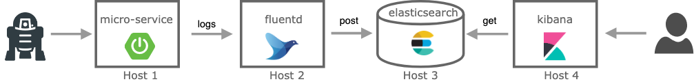

# Dockerized spring-boot app with EFK stack for centralized logging

This project presents how to dockerize an spring-boot app and run it together with EFK (elastic-search, fluentd, kibana)
stack as a different containers in order to learn how docker and docker-compose work.

<p align="center">
  
</p>

Components:
- `micro-service`: spring-boot rest application, it will listen to a simple *http get*, then it will respond with 
a hello-world message to the client and write it also in the application log. Logs will be sent to fluentd.
- `fluentd`: Unify all facets of processing log data: collecting, filtering, buffering, and outputting logs across multiple sources and destinations.
In our case, it will receive logs from the microservice format and forward/post them to elasticsearch.
- `elastic-search`: Search engine and a full-text, distributed NoSQL database.
- `kibana`: Front-end for elastic-search.

## Pre-requisites

`docker` and `java8`

## Create a simple spring boot app

The application is a super simple "micro-service" made in java 8 and spring-boot that exposes one simple endpoint:
```bash
curl -i http://localhost:8080/hello-world
HTTP/1.1 200 
Content-Type: text/plain;charset=UTF-8
Content-Length: 12
Date: Tue, 23 Jul 2019 14:29:31 GMT

Hello world!% 
```
Check the code in [app folder](./micro-service).

## Execute the app without docker
Build and run the micro-service:
```bash
cd micro-service
./gradlew build
java -jar build/libs/micro-service-0.0.1-SNAPSHOT.jar &
open http://localhost:8080/hello-world
```

## Execute the app with docker  

[Docker_CheatSheet](https://www.docker.com/sites/default/files/Docker_CheatSheet_08.09.2016_0.pdf)

### Dockerize the app
Build the micro-service artifact (from project root folder):
```bash
(cd micro-service && ./gradlew build)
```

Write a [Dockerfile](./micro-service/Dockerfile):
```
# Download docker from docker hub with all dependencies to run a java 8 application
FROM java:8-jdk-alpine

# Moving the app artifact from the host to the container
COPY ./build/libs/micro-service-0.0.1-SNAPSHOT.jar /usr/app/micro-service.jar

# The WORKDIR instruction sets the working directory for any RUN, CMD, ENTRYPOINT, COPY and ADD instructions that follow it in the Dockerfile.
WORKDIR /usr/app

# With it we inform Docker that a container will listen to specific port, the same as our app is using.
EXPOSE 8080

# Tell Docker to run the application, where first value is a command and the last two are parameters
ENTRYPOINT ["java","-Djava.security.egd=file:/dev/./urandom","-jar","micro-service.jar"]
```

Build the image and tag it:
```bash
docker build -t micro-service ./micro-service/.
```

Check the image is already created: 
```bash
docker images
```
```bash
REPOSITORY                                      TAG                 IMAGE ID            CREATED             SIZE
micro-service                                   latest              28a816a8dbd9        X days ago          163 MB
...
```
**Great!** now we have the java application in a controlled container.

Run the image in background:
```bash
docker run -d -p 3333:8080 --name ms -t --rm micro-service
```
`--name` to name th image
`--rm` to remove when killing the image, if not you will have to `docker ps -a` and `docker rm {id}` 

Check it is running as expected with docker:
`open http:localhost:3333/hello-world` or `curl -i http://localhost:3333/hello-world`

If you want to access to the container sh console:
```bash
docker exec -it ms /bin/sh
```

## Execute the app with docker-compose

Now that we have a docker image with the microservice up and running what we want is to add more containers and make them to communicate,
simulating a real environment.

To achieve that we will use `docker-compose` command: 

- [Compose](https://docs.docker.com/compose/) is a tool that comes with docker for defining and running multi-container Docker applications, usually used for development and testing purposes. 
With Compose, you use a YAML file to configure your application’s services. Then, with a single command, you create and start all the services from your configuration.

So, let's write a simple [docker-compose.yaml](docker-compose.yml):

```yaml
version: '3'
services:
  micro-service:
    image: micro-service
    build: ./micro-service
    ports:
      - "3333:8080"
```
- `ports` Expose ports (HOST:CONTAINER)

And run:
```bash
docker-compose up
```

## Add EFK stack (elastic-search, fluentd, kibana) to centralize the logs

### Change the micro-service to send logs to fluentd server

#### Add logback fluentd appender to the microservice

Now we need to config the application to send logs to fluentd data collector.

Add fluentd dependency to [gradle file](./micro-service/build.gradle)

```
dependencies {
   ...
    implementation group: 'org.fluentd', name: 'fluent-logger', version: '0.3.4'
    implementation group: 'com.sndyuk', name: 'logback-more-appenders', version: '1.5.6'
   ...
}
```

Add [logback file](./micro-service/src/main/resources/logback.xml) with the fluentd appender:

```xml
<?xml version="1.0" encoding="UTF-8"?>
<configuration>
    <include resource="org/springframework/boot/logging/logback/base.xml"/>
    <!-- If there is no ENV var FLUENTD_HOST then use localhost -->
    <property name="FLUENTD_HOST" value="${FLUENTD_HOST:-localhost}"/> 
    <property name="FLUENTD_PORT" value="${FLUENTD_PORT:-24224}"/>
    <appender name="FLUENT" class="ch.qos.logback.more.appenders.DataFluentAppender">
        <!-- Check tag and label fluentd info: https://docs.fluentd.org/configuration/config-file-->
        <tag>microservice.helloworld.access</tag>
        <label>normal</label>
        <remoteHost>${FLUENTD_HOST}</remoteHost>
        <port>${FLUENTD_PORT}</port>
    </appender>

    <appender name="CONSOLE" class="ch.qos.logback.core.ConsoleAppender">
        <layout class="ch.qos.logback.classic.PatternLayout">
            <Pattern>
                %d{HH:mm:ss.SSS} [%t] %-5level %logger{36} - %msg%n
            </Pattern>
        </layout>
    </appender>

    <root level="info">
        <appender-ref ref="CONSOLE" />
        <appender-ref ref="FLUENT" />
    </root>
</configuration>
```

If we try to run our container or just the app, it will fail. 

```bash
ERROR o.f.logger.sender.RawSocketSender - org.fluentd.logger.sender.RawSocketSender
```
It fails because there is no fluentd running neither in docker or localhost.

#### Add fluentd container

To add fluentd we will add three things to make it work:

##### 1. Add Fluentd Docker file
We will create extend fluentd docker image because we will install an elasticsearch plugin.
All fluentd files are placed in [`/fluentd` folder](fluentd)
```
# fluentd/Dockerfile
FROM fluent/fluentd:v0.12-debian
RUN ["gem", "install", "fluent-plugin-elasticsearch", "--no-rdoc", "--no-ri", "--version", "1.9.2"]
```
##### 2. Add Fluentd config file
Now, we need to add a [configuration file](https://docs.fluentd.org/configuration) to control the input and output behavior of Fluentd.
We will start with a simple behaviour, just print all logs coming from the microservice to the stdout in the fluentd host:
```
# Directives that determine the input sources
<source>
    # @type 'my_plugin_type': 'forward' plugin turns fluentd into a TCP endpoint to accept TCP packets
    @type forward
    
    # endpoint listening to port 24224
    port 24224
    
    # The bind address to listen to. In the context of servers, 0.0.0.0 means "all IPv4 addresses on the local machine". 
    # If a host has two ip addresses, 192.168.1.1 and 10.1.2.1, and a server running on the host listens on 0.0.0.0, 
    # it will be reachable at both of those IPs.
    bind 0.0.0.0
</source>

# This directive looks for events with matching tags and processes them
# in our case it match everything
<match **>
    # this output plugin prints events to stdout
    @type stdout
</match>
```
More info for plugins or configuration at [official documentation](https://docs.fluentd.org/).
##### 3. Add Fluentd to docker-compose  

Let's add fluentd container to our docker compose file:
```yaml
version: '3'
services:
  micro-service:
    build: ./micro-service
    ports:
      - "3333:8080"
    environment:
      - FLUENTD_HOST=fluentd
      - FLUENTD_PORT=24224
    networks:
      - microservice-network

  fluentd:
    build: ./fluentd
    volumes:
      - ./fluentd/conf:/fluentd/etc
    ports:
      - "24224:24224"
      - "24224:24224/udp"
    networks:
      - microservice-network

networks:
  microservice-network: 
    name: microservice_network
    driver: bridge # we have specified it, but this is the default driver
```

Here we have introduced [`networks`](https://docs.docker.com/network/), docker provide this feature to connect different containers together.
We are using the default [`bridge` driver](https://docs.docker.com/network/bridge/), in a nutshell, a bridge network will 
expose to all containers connected all ports to each other and automatic DNS resolution between containers. 


